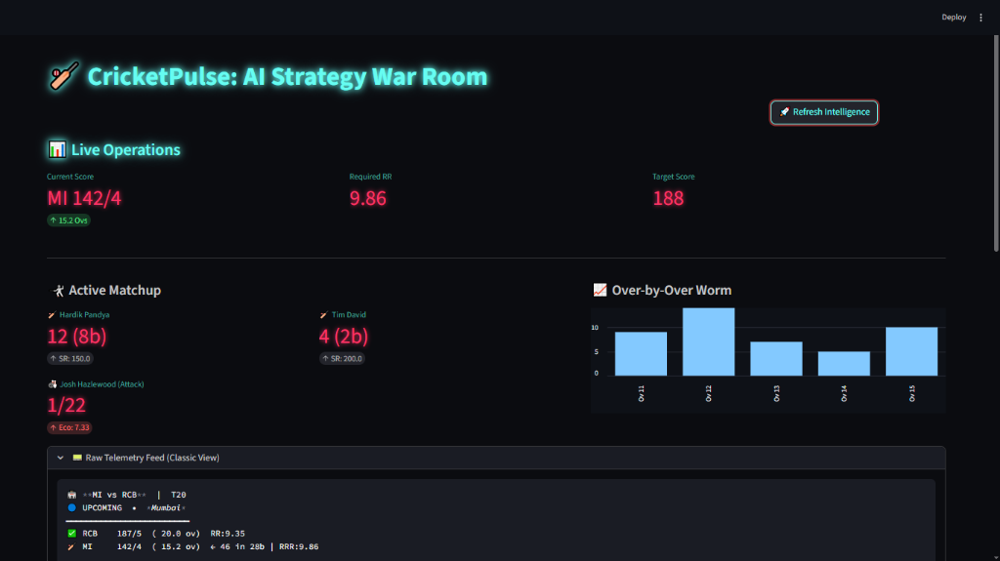
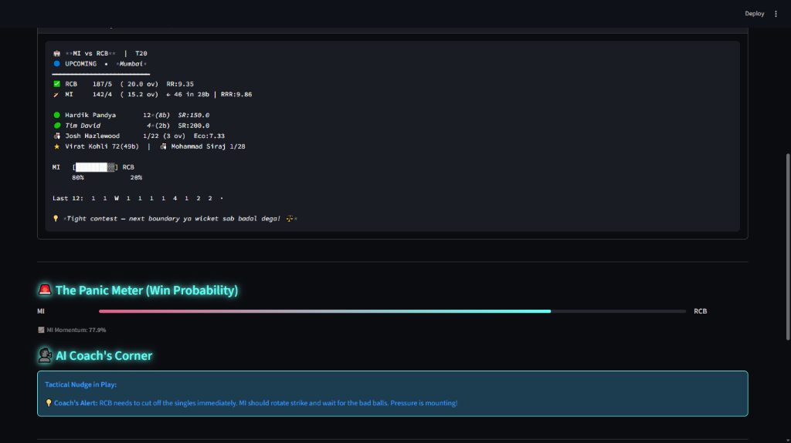
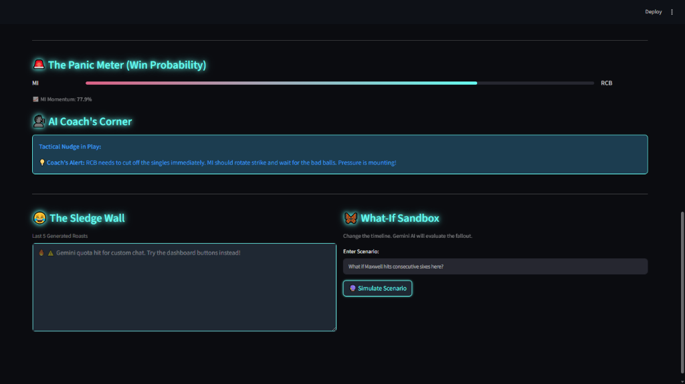
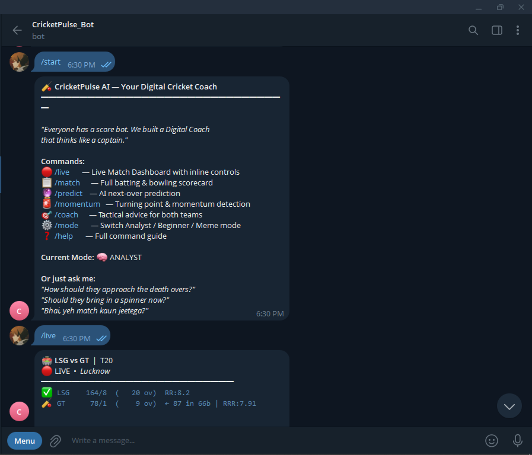
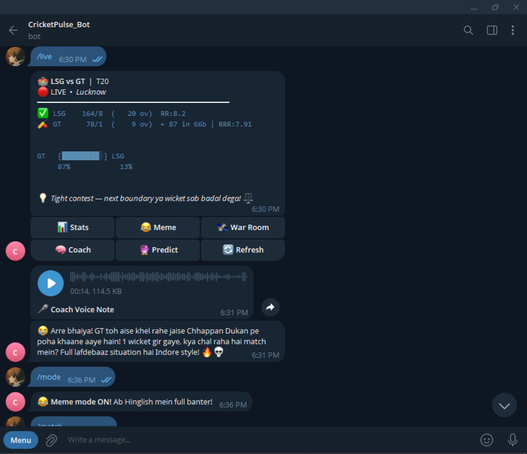
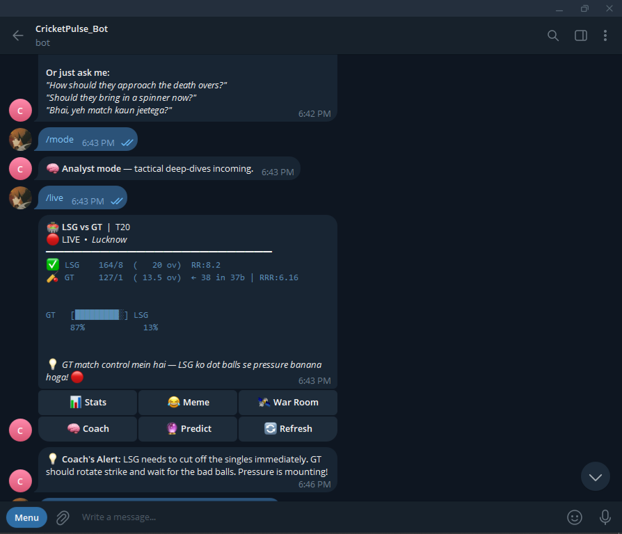
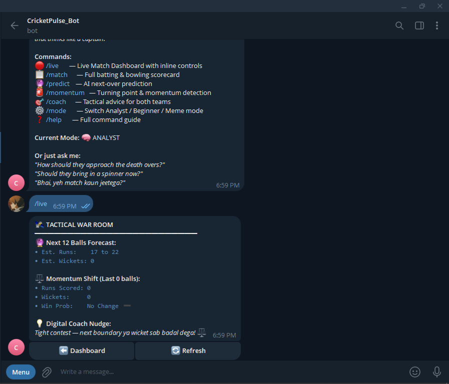

# 🏏 CricketPulse AI
**The Ultimate Agentic AI-Powered Tactical Cricket War Room**

**CricketPulse AI** entirely reimagines what a cricket bot can be. It is a multimodal, agentic intelligence layer that sits on top of raw live cricket APIs. By utilizing *Google Gemini 2.0 Flash*, CricketPulse delivers dynamic tactical forecasts, non-ML algorithmic momentum analysis, counterfactual wargaming, and localized cross-modal voice generations—served simultaneously across a Telegram Bot and a highly-visual Streamlit Web Dashboard.

## 🔗 Live Access
> ⚠️ **Notice:** Public live links are currently inactive to prevent free-tier API exhaustion. To explore the bot and dashboard, please follow the **Local Development & Extension** guide below!

* **📱 Telegram Bot:** [CricketPulse_Bot](https://t.me/CricketPulse_Bot) 
* **🌐 Web Dashboard:** [Live War Room](https://cricket-pulse-ai.streamlit.app/)

---

> [!IMPORTANT]
> **⚠️ API Quota Note**
> This project is optimized for the **Gemini API Free Tier**. While the architecture uses a Mega-Prompt caching system to minimize calls, users may still encounter `429 RESOURCE_EXHAUSTED` errors if the 15 RPM (Requests Per Minute) limit is exceeded. The application includes an **Offline Fallback mode** to maintain functionality during these periods.

## 🧠 Core AI Architecture

### 1. The "Mega-Prompt" Caching Layer
Standard bots fire API calls on every button interaction, often leading to rate-limit exhaustion during heavy use. CricketPulse AI uses a highly efficient **Mega-Prompt Architecture**:
- It pulls live match context periodically and commands Gemini to generate **all operational branches** (Strategy, Meme, Coach, Predictions) collectively inside a strictly formatted JSON payload.
- Both the Web Dashboard and the Telegram UI read purely from this memory cache, resulting in **0-millisecond latency** responses for users and over an 85% drop in LLM API requests.

### 2. Algorithmic Fallback & Resilience
System reliability is critical. CricketPulse possesses an intelligent **Offline Fallover Mode**:
- If the core LLM quota is exhausted, the `agent_brain` automatically detects the `RESOURCE_EXHAUSTED` exception.
- It bypasses the LLM and dynamically reconstructs the live scorecard data into authentic-looking conversational responses using rule-based parsing, ensuring the application remains functional without service interruptions.

### 3. Edge-Computed Win Probability Engine 
Instead of relying entirely on AI generation, CricketPulse runs a proprietary, lightweight **DLS-inspired mathematical engine** (`win_probability.py`) locally on the host CPU. It calculates exact required-run-rate pressures and matches phases deterministically to generate live Win Probabilities in microseconds. 

---

## 🚀 The Multi-Platform Experience

### 🌐 The Streamlit Command Center
An immersive, Dark-Mode Web Dashboard serving as a War Room operations screen.

<div align="center">
  
  <br/>
  
  <br/>
  
</div>

- **The Panic Meter:** A dynamic progression bar calculating real-time Match Momentum based on the local deterministic math engine.
- **Over-by-Over Worm & Active Matchups:** Natively plots live match trajectories, extracting specific active batters' Strike Rates and active attacking bowler Economies precisely.
- **The AI Sledge Wall:** A persistent memory wall displaying the last 5 localized conversational roasts generated by the AI agent.

### 📱 The Pocket Telegram Agent
An impossibly fast conversational interface that brings the tactical coach to your messaging app.

<div align="center">
  <table style="border: none;">
    <tr>
      <td style="border: none;"></td>
      <td style="border: none;"></td>
    </tr>
    <tr>
      <td style="border: none;"></td>
      <td style="border: none;"></td>
    </tr>
  </table>
</div>

- **Cross-Modal Voice Nudges (`gTTS`):** Activating the Meme mode triggers an internal audio synthesis loop. The bot parses the localized, conversational response generated by Gemini, synthesizes an `.mp3`, and delivers it directly into the Telegram Chat as an instant native Voice Note.
- **The "Butterfly Effect" Simulator:** Actively rewrite historical timelines. Need to know what happens if consecutive wickets fall? Type `/simulate What if Kohli hits three straight sixes?` into the Sandbox or Chat, and the AI will algorithmically play out the alternate reality, calculating the new resulting psychological momentum swings.

---

## 🛠️ Technology Stack
- **Backend Orchestration:** Python 3.11+, AsyncIO
- **Generative AI:** Google Gemini 2.0 Flash (Agent Brain)
- **Data Intake:** CricAPI (Asynchronous JSON Bridge)
- **Frontend / Visualization:** Streamlit, Python-Telegram-Bot
- **TTS Synthesis:** Google Text-to-Speech (`gTTS`)

## 💻 Local Development & Extension

If you'd like to extend CricketPulse AI or run a private instance:

1. **Clone the Repository:**
   ```bash
   git clone https://github.com/devesh-talreja/CricketPulse-Ai.git
   cd CricketPulse-Ai
   ```

2. **Install Dependencies:**
   ```bash
   pip install -r requirements.txt
   ```

3. **Configure Environment:**
   Create a `.env` file in the root directory:
   ```env
   TELEGRAM_TOKEN=your_telegram_bot_token
   GEMINI_API_KEY=your_gemini_api_key
   CRICKET_API_KEY=your_cricapi_key
   ```

4. **Run Locally:**
   * **Telegram Bot:** `python bot.py`
   * **Web Dashboard:** `streamlit run app.py`

## ☁️ Deployment Guide (Web Dashboard)

To host your own public version of the web dashboard for free:

### Streamlit Community Cloud
1. Push your code to your GitHub repository.
2. Sign in to [Streamlit Cloud](https://share.streamlit.io/).
3. Click "New app", select your repo, and set `app.py` as the main file.
4. Add your `.env` variables (tokens) in the **"Secrets"** section of the Streamlit dashboard settings. This allows the dashboard to be accessible via a public URL without requiring any local setup from your users.

## 🤝 Contributing
Contributions, issues, and feature requests are welcome! Feel free to check the [issues page](https://github.com/devesh-talreja/CricketPulse-Ai/issues).

## 📝 License
This project is open-source and available under the [MIT License](LICENSE).
